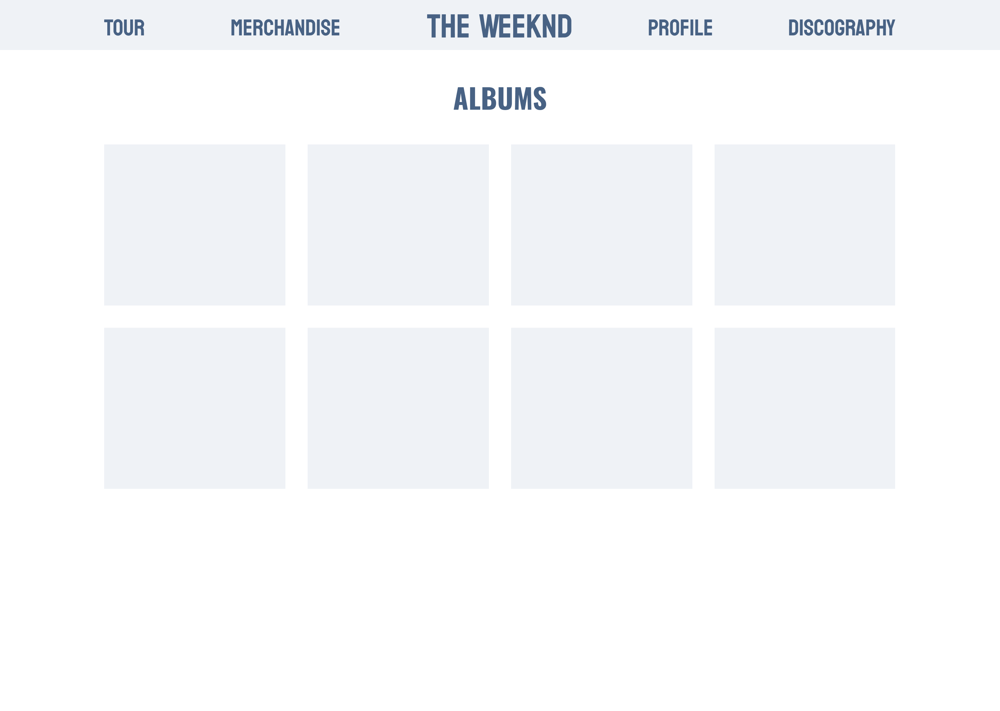

  <h2 align="center">
    Proyek Web SED
  </h2>

 <!-- Daftar Isi -->

  
<h2 style="display: inline-block">Daftar Isi</h2>

  <ol>
    <li><a href="#anggota-tim">Anggota Tim</a></li>
    <li><a href="#Fungsi-website">Fungsi</a></li>
    <li><a href="#Tujuan-website">Tujuan</a></li>
    <li><a href="#Target-Pengguna">Target Pengguna</a></li>
    <li><a href="#Skema-Database">Skema Database</a></li>
    <li><a href="#Mockup-Sederhana">Mockup Sederhana</a></li>
  </ol>

<!-- Anggota Tim -->
## Anggota Tim
| NPM           | Name        |
| ------------- |-------------|
| 140810220013  | Stevanus Felixiano   |
| 140810220043  | Darren Christian Liharja   |
| 140810220057  | Muhammad Exsfo Al Banjari  |

<!-- Fungsi Website -->
## **Fungsi Website**

Website ini akan memiliki berbagai fungsi yang dirancang untuk memenuhi kebutuhan penggemar dan juga untuk mempromosikan The Weeknd kepada publik. Beberapa fungsi utama yang akan disertakan dalam website ini meliputi:
- Profil Artis: Menyediakan informasi lengkap tentang The Weeknd, termasuk biografi, riwayat karier, penghargaan, dan foto-foto terbaru.
- Berita Terbaru: Menyajikan berita terkini tentang kegiatan The Weeknd, rilis musik terbaru, dan berita seputar dunia musik.
- Diskografi: Menampilkan daftar lengkap album, singel, dan kolaborasi yang telah dirilis oleh The Weeknd, beserta tautan untuk mendengarkan atau membeli musiknya.
- Jadwal Tur Konser: Informasi tentang tanggal, lokasi, dan tiket untuk konser-konser The Weeknd yang akan datang.
- Galeri Foto dan Video: Menyediakan galeri yang berisi foto-foto dan video-video eksklusif dari konser, video klip, dan momen-momen di balik layar.
- Toko Merchandise: Penggemar dapat membeli merchandise resmi The Weeknd, seperti pakaian, aksesori, dan barang-barang koleksi.
- Kontak dan Sosial Media: Menampilkan tautan ke akun media sosial resmi The Weeknd, serta informasi kontak untuk tujuan bisnis dan kerjasama.

<!-- Tujuan Website -->
## **Tujuan Website**

Website ini bertujuan untuk mencapai beberapa tujuan utama, yaitu:
- Meningkatkan Keterlibatan Penggemar: Dengan menyediakan konten eksklusif, berita terbaru, dan akses langsung ke artis melalui media sosial, kami berharap website ini akan meningkatkan keterlibatan penggemar dengan The Weeknd.
- Mempromosikan Musik dan Tur Konser: Website akan menjadi platform utama untuk mempromosikan musik baru The Weeknd dan tur konsernya, membantu meningkatkan penjualan tiket dan album.
- Mengumpulkan Data Penggemar: Kami akan menggunakan website ini sebagai alat untuk mengumpulkan data tentang penggemar, termasuk lokasi geografis, preferensi musik, dan informasi kontak.

<!-- Target Pengguna -->
## **Target Pengguna**

Website ini ditujukan untuk berbagai kelompok target pengguna, termasuk:
- Penggemar Setia: Penggemar berat The Weeknd yang ingin mendapatkan informasi terbaru, akses ke musik dan video eksklusif, serta kesempatan untuk membeli merchandise resmi.
- Pencinta Musik: Orang-orang yang tertarik dengan musik R&B dan pop, dan ingin mengeksplorasi karya-karya The Weeknd.
- Penyelenggara Konser: Pihak-pihak yang ingin berkolaborasi atau mengatur pertunjukan The Weeknd.
- Media dan Pers: Jurnalis, blogger, dan outlet media yang mencari informasi terbaru tentang The Weeknd untuk liputan mereka.
- Pengiklan dan Sponsor: Perusahaan-perusahaan yang tertarik untuk beriklan atau mensponsori konten di website resmi The Weeknd.

<!-- Skema Database -->
## Skema Database

<!-- Mockup Sederhana -->
## Mockup Sederhana

